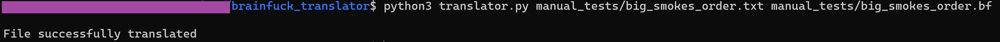
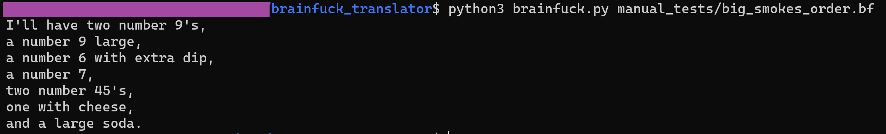

# TXT to Brainfuck Translator

## What it does
Translates .txt files into brainfuck code

## How to run program
In terminal, run `python3 translator.py {input filename.txt} {output filename.bf}` to translate a txt file of your choice into brainfuck.

To use the compiler to run brainfuck code, run `python3 brainfuck.py {filename.bf}`.

### Example
`python3 translator.py manual_tests/big_smokes_order.txt manual_tests/big_smokes_order.bf` 

`python3 brainfuck.py manual_tests/big_smokes_order.bf`

## Sources
1. [Compiler code](https://mathspp.com/blog/writing-interpreter-in-15-loc)