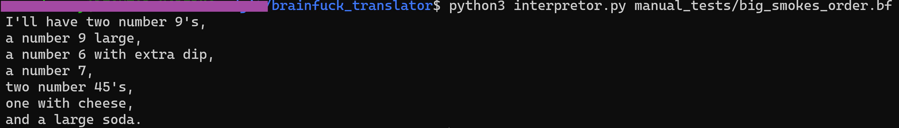

# TXT to Brainfuck Translator

## What it does
Translates .txt files into brainfuck code

## How to run program
In terminal, run `python3 translator.py {input filename.txt} {output filename.bf}` to translate a txt file of your choice into brainfuck.

To use the interpreter to run brainfuck code, run `python3 interpretor.py {filename.bf}`.

### Example
This txt file below can be translated into Brainfuck code.

Running `python3 translator.py manual_tests/big_smokes_order.txt manual_tests/big_smokes_order.bf` in the terminal will look like this.

The resulting Brainfuck code from the command can be seen here.

This can then be translated using `python3 interpretor.py manual_tests/big_smokes_order.bf` seen below.

## Sources
1. [Interpreter code](https://mathspp.com/blog/writing-interpreter-in-15-loc)